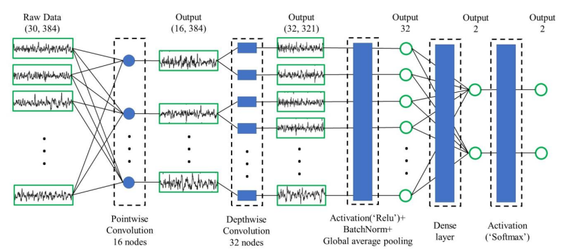
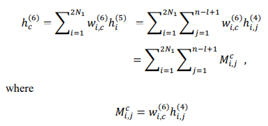
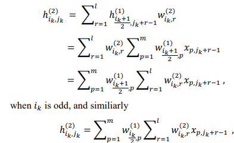
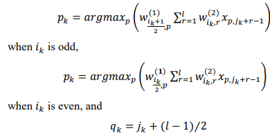
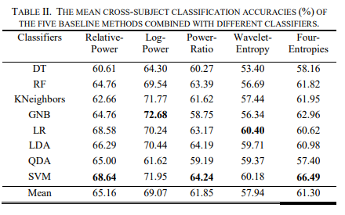

We aim to develop of a drowsiness monitoring system to continuously watch the vigilance state of the driver and send alarm before the driver falls asleep. However, building a calibration-free drowsiness recognition system is still a challenging task. The difficulty lies in capturing common drowsiness-related patterns from a diversity of EEG signals with a low signal-to-noise rate.

## RELATED WORKS:
1. **Existing driver monitor systems :**
-  CCD camera with infrared LED detectors by Toyota.
-  Focus and Mondeo models judging lane tracking performance by Ford
-  biometric car seat prototype tracking physiological signals by Ford
and others.

2. **EEG-based driver drowsiness recognition :**
EEG measures voltage difference on the scalp resulted from ion currents caused by synaptic activities of thousands of pyramidal neurons happening on the surface layer of the brain underneath.  Existing EEG systems have 1 to 256 electrodes, and the placement of electrodes follows a formal standard called **10–20 system** or **International 10–20 system.** 
Existing studies have revealed the relationship between drowsiness and the oscillation patterns of EEG signals.
It was summarized by Klimesch that drowsiness can in general cause an increase in power of the Theta and Alpha frequency bands. Moreover, increase in lower Alpha power occurs only when subjects are struggling not to sleep, while the Alpha power will decrease when subjects fall asleep.
For the task proposed a simple convolutional network consisting of two convolutional layers, a max-pooling layer, a flatten and a fully connected layer to classify single-channel EEG data for Advance Driver Assistance Systems (ADAS) of automotive, was proposed.

## MATERIALS AND METHODS
### DATA PREPARATION:
- The dataset 
was collected from 27 subjects (aged from 22 to 28)
- The participants were required to respond immediately to the events by driving the car 
back to central lane. The drowsiness level can be reflected by how fast the subjects respond to the events.
- sampled at 500 Hz with 30 electrodes and processed with 1-50 Hz bandpass filters and artifact rejection
- Each sample has a dimension of 30 (channels) × 384 (sample points)
- **local reaction time (RT)**: the time taken by the subject to respond to the car drift event, **global-RT**: which is the average of RTs within a 90-second window before the car drift event
- The **baseline “alert-RT”** for each 
session was defined as the 5th percentile of the local RTs. Samples with both local-RT and global-RT shorter than 1.5 times alert-RT were labeled as alert state, while samples with both local-RT and global-RT longer than 2.5 times alert-RT were labeled as drowsy state
- discarded sessions with less than 50 samples of either class.
- performed these two additional selection procedures in order to loosely balance the samples for each class and each subject
-  finally got 
an unbalanced dataset of 2952 samples from 11 different 
subjects

### NETWORK DESIGN :
- Suppose the EEG signals recorded from m electrodes are {𝒙𝒊} 𝑖=1,2…𝑚. 𝑁1 new signals {𝒔𝒋} 𝑗=1,2…𝑁1 can be obtained from linear combination of the original m signals. 

The weights can be found using methods like Independent Component Analysis (ICA), Common Spatial Pattern (CSP), etc.

- The proposed processing sequence of EEG signal is similar 
to the concept of depthwise separable convolution. A **depthwise separable convolution**, or called **“separable convolution”**, consists of a depthwise convolution, which is performed on each channel independently, and a pointwise convolution (or called “1x1 convolution”), which projects the channels onto a new space.

- The network consists of seven layers.

The pointwise convolution and depthwise convolution are implemented in the first two layers, which are followed by a ReLU activation layer, a batch normalization layer, a global average pooling layer, a dense layer and a Softmax activation layer. 

In the first layer, we use 𝑁1 pointwise convolutional nodes to generate 𝑁1 new channels of signals with the same length. The outputs from the first layer:

where i = 1, 2, 3, …, 𝑁1 and **𝑥𝑝,𝑗** is the j-th sampling point of the p-th channel of the input EEG sample. The superscripts of the outputs and network parameters indicate which network
layer they belong to.

In the second layer, depthwise convolutions are used to extract features from the 𝑁1 obtained signals using 2𝑁1 depthwise convolutional nodes. The output:

For the consequent layers:

### INTERPRETATION TECHNIQUE:
The Class Activation Map (CAM) method is a powerful interpretation technique that can localize the discriminative regions of each input sample for a CNNmodel trained to solve a classification task. For each input sample a heatmap is generated from the activations after the last convolutional layer. CAM method was originally designed for deep CNN networks with only standard convolutional layers and cannot be used directly for our model.
Our objective is to find the heatmap 𝑆(𝑚,𝑛)𝐶
for 𝑋(𝑚,𝑛) that can reveal important regions for the prediction by the network. We have,

**𝑀𝑖,𝑗𝑐** is the activation map of class c for the sample **𝑋(𝑚,𝑛)**.

 The first (channel) dimension of **𝑀𝑖,𝑗𝑐** misaligned with the first (channel) dimension of the input signal. We trace only a small portion of the positions in the activation map that contribute most to the class activation **ℎ𝑐(6)**. Specifically, we rank the values of **𝑀𝑖,𝑗𝑐** in a descending order.

The final heatmap for sample  **𝑋(𝑚,𝑛)** can be obtained by combining all the class discriminative points in the input sample with the Gaussian function.

 𝜎 is a constant that decides radius of the influential area of each discriminative point in the input signal. The output is further normalized to (-1,1).
 
The discriminative locations are unchanged after the 3rd and 4th layers of the network. From previous relations, we have:

Therefore, the discriminative location **(𝑖𝑘,𝑗𝑘)** in **𝑀𝑖,𝑗𝑐** can be traced back to the center **(𝑝𝑘, 𝑞𝑘)** of the strongest contributing episode in the input signal, where:

### METHODS FOR COMPARISON:
1. **Deep learning methods:**  The study compares deep learning models for EEG signal classification, including EEGNet-4,2, EEGNet-8,2, Sinc-ShallowNet, and Conv-ShallowNet. Key components include 2D and depthwise convolutions, sinc functions, and the evaluation of cross-subject driver drowsiness recognition.
2. **Conventional baseline methods:** We implement five baseline methods for feature extraction and test them on eight different classifiers for comparison:
- **Relative Power:** It uses relative band powers as the first baseline method.
- **Log Power :** natural log of the band power instead of 
relative power is calculated.
- **Power Ratio:**  four band power ratios (i) (θ+α)/β , (ii) α/β, (iii) (θ+ α)/(α+ β) and (iv) θ/β were found to be good indicators of driver drowsiness
- **Wavelet Entropy:**  The wavelet entropy feature for each EEG channel is calculated by applying the **Shannon function** on the normalized wavelet coefficients.
- **Four Entropies:** We use four types of entropies, which are sample entropy, fuzzy entropy, approximate entropy and spectral entropy for driver fatigue recognition.
- **Classifiers:** Different classifiers have been implemented, 
which include Decision Tree (DT), Random Forest (RF), k-nearest neighbors (KNeighbors), Gaussian Naive Bayes (GNB), Logistic Regression (LR), LDA, Quadratic Discriminant Analysis (QDA), and SVM

3. **Variations of the model for comparison:**
- we replace the pointwise and the depthwise convolutional layers of 
the network with a standard convolutional layer containing 32 
kernels with length of 64. We name this model as “1DConv”.
- In the second and the third variations, we remove the 
depthwise convolutional layer and the pointwise convolutional 
layer and name as “NoDepthwise” and “NoPointwise”, repectively.
- Finally, the batch normalization layer is removed. We name the model as 
“NoBatchNorm”.

### IMPLEMENTATION DETAILS:
The comparison study was conducted on an Alienware Desktop with a 64-bit Windows 10 OS, Intel i7-6700 CPU, and NVIDIA GeForce GTX 1080 GPU, using Python 3.6.6. Deep learning models, including the proposed model and Sinc-ShallowNet variations, were implemented with PyTorch, while EEGNet models ran on TensorFlow's Keras API. Initial tests revealed accuracy drops due to default batch normalization, which was mitigated by disabling mean and variance estimation. The models were trained with the Adam optimizer, batch size of 50, and default parameters (η=0.001, β1=0.9, β2=0.999). Conventional methods employed Welch's method for feature extraction and sklearn library classifiers with default settings.

## EVALUATION ON THE PROPOSED METHOD

### MODEL COMPARISON RESULTS:
we conduct leave-one-subject-out cross validation to compare the classifiers. Specifically, the EEG data from one subject are used for testing, while data from all the other subjects are used for training the classifiers. The process is iterated until every subject serves once as the test subject.

1. **Mean accuracy comparison on the balanced dataset:**
We trained each deep learning model from 1 to 50 epochs. We randomized the network parameters for each iteration and repeated the process for 10 times. In this way, 10 (times) x 11 (subjects) = 110 folds were created for each epoch.

2. **Individual comparison results on the unbalanced dataset:**
Here we compare the best baseline methods with the proposed method on unbalanced data for each individual. Specifically, we conduct leave-one-subject-out cross validation, where the unbalanced EEG data from one subject is used for testing, while the balanced data from all the other 
subjects are used for training in order to obtain the unbiased classifiers. We use precision and recall to evaluate the classification on the unbalanced data.

### Interpretation on the learned characteristics from EEG signals:
The study aims to derive insights into model validation by analyzing patterns learned by the model to distinguish between alert and drowsy EEG signals. 
- Representative samples correctly classified with high confidence show that drowsy signals often contain high portions of Theta and Alpha waves.
-  Specifically, Theta band bursts and Alpha spindles are strong indicators of drowsiness, with central EEG channels playing a crucial role. 
-  Alert signals, on the other hand, often contain more artifacts, such as Beta waves from peripheral channels and Delta waves from eye movements, which are mistakenly identified as alertness indicators. 
-  We find that sensor noise contained in the EEG signals is one of the major reasons that lead to the low classification accuracy

